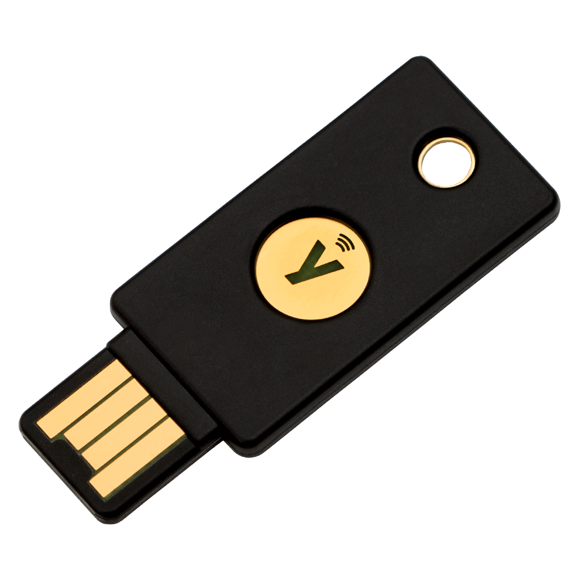
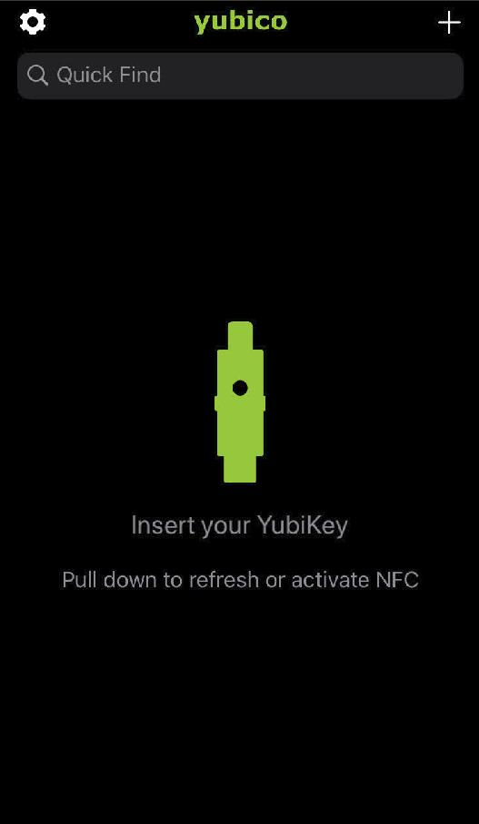

# Using hardware tokens to secure your digital identity.
I hope to create some awareness around securing your digital identity, to make it harder for malicious people to steal/misuse your online accounts. I think this begins by enabling 2FA/MFA where it is possible and create a good backup for that as well.

The thing is, you don't want to get locked out of your account when losing a hardware token. (Or breaking your hardware token for that matter)

## A little background on SFA/2FA/MFA
What is 2FA(Two factor authentication)/MFA(Multi factor authentication)? According to [wikipedia](https://en.wikipedia.org/wiki/Multi-factor_authentication):
1) Something the user knows (and only the user knows)
2) Something the user has (and only the user has)
3) Something the user is (and only the user is)

So for example:
1) could be a password 
2) could be an security token 
3) could be a fingerprint or retina scan or something else.

2FA is a basicly a subset of the above. And like the name, it is 2 factor. So this is a form of MFA, but not every MFA is a 2FA.

The absolute worst you can have is a SFA (Single factor authentication). Your account could be vulnerable to a number of attacks. Brute forcing / dictionary checking is one of them. A lot of people still use an easy, dictionary based password that also is used for different services as well. I will not go into detail on this problem but it happens. A lot. 


There are all kinds of 2FA available. The most known 2FA are:
1) SMS token
2) Authenticator app (approval based sign in or OTP (one time password))
3) Security token

A list of pros and cons can be found [here](https://www.scentropic.com/blog/2018/aug/google-2fa/google-2fa.shtml)

Basically the security token is the most secure option here. There are also lots of tokens available on the market. Google has the [titan security key](https://cloud.google.com/titan-security-key/). Or the [onlykey](https://onlykey.io/). 
I decided to go with the Yubico brand because they have implemented a lot of authentication options.

I have the following devices to play with:
1) [YubiKey C Nano FIPS](https://www.yubico.com/product/yubikey-c-nano-fips) (USB Type-C form factor)


2) [YubiKey 5 Nano](https://www.yubico.com/product/yubikey-5-nano) (USB Type-A form factor) 


3) [YubiKey 5 NFC](https://www.yubico.com/product/yubikey-5-nfc) (USB Type-A form factor)




So it is Yubikey 4 FIPS device and 2 Yubikey 5 (the NFC and small form factor).

FIPS 140 levels explained [here](https://datalocker.com/fips-140-2-levels-explained/).
Basicly what it boils down to is that it adds a tamper-evidence coating. So you should be able to see that your device is tampered with. Also when trying to get to the cryptographic module it will break the device.

## Yubikey 2FA/MFA

Over the past couple of months I started using Yubikeys for hardening my online posture and incorporating 2FA with every service possible. 

[Here](https://www.dongleauth.info/) is a website which lists all sites using OTP/U2F

I am using it to store my GPG keys and sign my commits and use the hardened ssh-agent. (What's really cool is that [openssh 8.2](https://www.openssh.com/txt/release-8.2) is released and supports the Yubikey tokens out of the box).

Questions may arise. For example: why not an authenticator app, or sms based 2FA? Simply because it is less secure.
It might be good for services online that are of lesser importance, but when it is about mail take no consessions. Be secure as you can get.
Simply because the mail is the root of your identity online. When this account is compromised password resets can be done for a lot of services you registered for.

## Checking the Yubikeys

The first thing i did was verify the genuity of my yubikeys

https://www.yubico.com/genuine/

If you want to check this manually you can check on how to do that [here](https://maxammann.org/posts/2019/09/verifying-yubikeys-for-genuity/)

## Installation of yubikey-manager software
Installation is covered [here](https://support.yubico.com/support/solutions/articles/15000010964-enabling-the-yubico-ppa-on-ubuntu). But basicly:
```
sudo apt-add-repository ppa:yubico/stable
sudo apt update
sudo apt install yubikey-manager-qt
```

With Yubikey manager you can configure different 


## Setup PGP keys
For this i followed a very good guide located here: https://github.com/drduh/YubiKey-Guide

It will guide you to all the steps of generating a masterkey and creating subkeys and move them to yubikey (except the masterkey, it should be saved offline in a safe place. So when you do all the steps and placed them on the yubikey you should see something like this:
```
gpg -K 
/home/michel/.gnupg/pubring.kbx
------------------------------------
sec#  rsa4096 2020-04-13 [C]
      D123E4C05FDD678987654A3F03ED4EAA4D0FB7E93
uid some-uid mails.
ssb>  rsa4096 2020-04-13 [S] [expires: 2021-04-13]
ssb>  rsa4096 2020-04-13 [E] [expires: 2021-04-13]
ssb>  rsa4096 2020-04-13 [A] [expires: 2021-04-13]
```
So the # after the masterkey indicates it is deleted.

The > after the subkey indicates it is only available on the yubikey.

So in the end you have A subkey for signing[S], encrypting[E] and authentication[A] on your yubidevice.

## Password manager configured with yubikey
Personally i landed up using [keepassxc](https://keepassxc.org/). I am not really fond of password managers that will [sync stuff to the cloud](https://securityaffairs.co/wordpress/91338/hacking/lastpass-credentials-leak.html).
Installing keepassxc on ubuntu it should be straight forward. You can use the standard ubuntu-repo's or install it with snap. If you install it with snap, don't forget to run:
```zsh
sudo snap connect keepassxc:raw-usb core:raw-usb
```
Configure you're
Yubikey manager: Applications>OTP>Long touch (slot2)
keepassxc: Database>Change Master key>Add additional protection>

With the yubikey-manager you can configure your yubikey. It also comes with the cli ykman tool which you can use as well.
Example options ykman:

### List yubikeys:
```
ykman list
YubiKey FIPS [OTP+FIDO+CCID] Serial: 1234567
```

### Info about your yubikey:
```
ykman info
Device type: YubiKey FIPS
Serial number: 1234567
Firmware version: 4.4.5
Enabled USB interfaces: OTP+FIDO+CCID

Applications
OTP     	Enabled      	
FIDO U2F	Enabled      	
OpenPGP 	Enabled      	
PIV     	Enabled      	
OATH    	Enabled      	
FIDO2   	Not available	

```
When multiple yubikeys inserted you have to use the --device flag
```
ykman --device 1234567 info
```

## Use of NFC Yubi 5 key
With this yubikey it is possible to install an [yubi authenticator](https://www.yubico.com/products/services-software/download/yubico-authenticator/) app on your NFC enabled phone. You scan an QR code and use multiple services in one application. Very nice.
After you added some services you can generate an 2fa code by refreshing it, and tapping the Yubikey NFC device to your phone:


And all the 2FA codes are generated:


## Ditch SFA, stay safe physically and digitally.
There are many more features when using the yubikey, for example, the [Yubikey PAM module](https://developers.yubico.com/yubico-pam/). So there is still a lot to figure out :)

This is it for now.

Michel van de Wouw